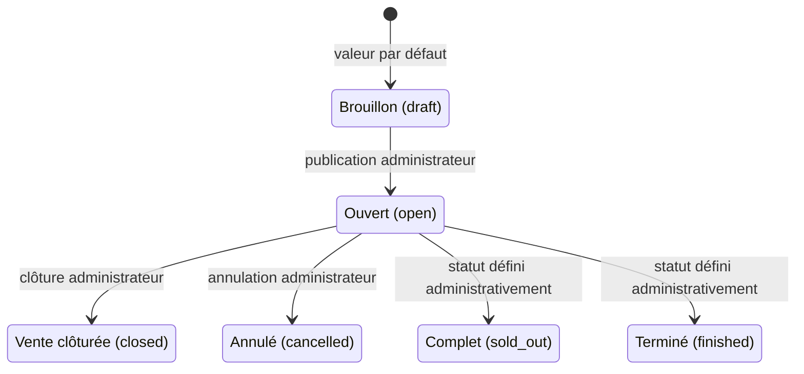
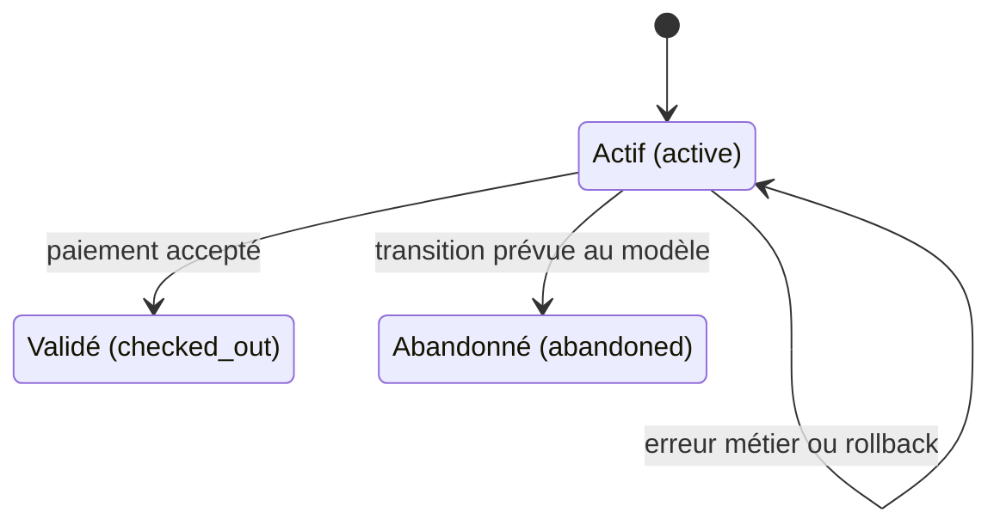
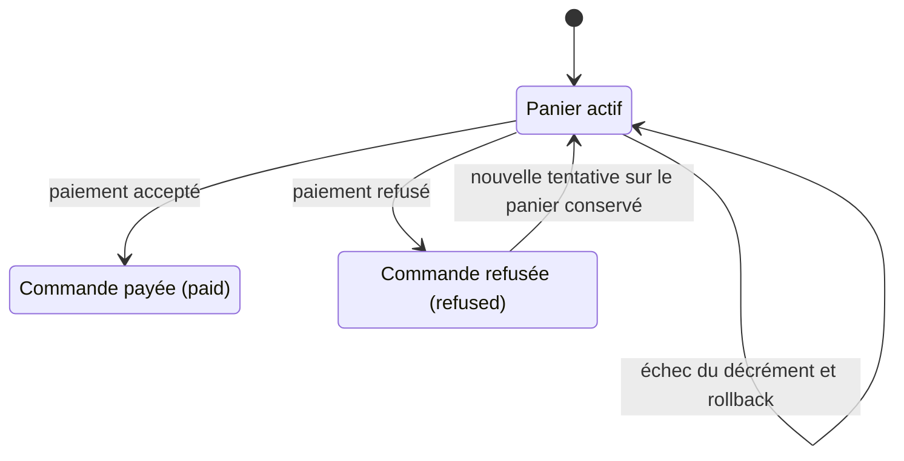

# Diagrammes d'états

Ces diagrammes décrivent les cycles de vie effectivement utilisés par
l'application. Les noms techniques correspondent aux valeurs stockées.

## Concert

Exigences liées : `EF1`, `EF2`, `EF11`, `EM4`, `EM5`, `EM9`, `RG1`,
`RG7`.

L'administration Django permet de choisir explicitement un statut. Les actions
de la synthèse des ventes imposent seulement les transitions vers `closed` et
`cancelled`. L'application ne transforme pas automatiquement un concert en
`sold_out` lorsque le stock atteint zéro, ni en `finished` lorsque sa date est
passée. La date et le stock sont néanmoins contrôlés directement pour empêcher
la réservation.

## Panier

Exigences liées : `EF5`, `EF6`, `EF7`, `EF8`, `EF9`, `EM1`, `EM2`,
`EM3`, `RG2`, `RG3`, `RG4`, `RG5`.

Le statut `abandoned` existe dans le modèle, mais aucune action utilisateur ne
l'emploie actuellement. Un paiement refusé et un échec transactionnel laissent
le panier actif.

## Commande et paiement

Exigences liées : `EF7`, `EF8`, `EF9`, `EF10`, `EF12`, `EM6`, `EM10`,
`RG4`, `RG5`.

Le service ne persiste pas de commande `pending` pendant le parcours simulé :
il crée directement une commande `paid` ou `refused`. Après un refus, une
nouvelle tentative crée une nouvelle commande ; elle ne transforme pas la
commande refusée précédente. Le statut `cancelled` existe dans le modèle mais
n'est pas exposé par le parcours actuel.

## Cas de test dérivés

| Cas | Transition vérifiée | Preuve principale | Exigences |
| --- | --- | --- | --- |
| Paiement accepté | Panier actif vers commande payée et panier validé | `test_accepted_payment_creates_paid_order_and_decrements_stock` | EF8, EF12, EM6, EM7, RG5 |
| Paiement refusé | Panier actif conservé et commande refusée créée | `test_refused_payment_does_not_create_validated_order_or_decrement_stock` | EF9, EM6, RG4 |
| Échec du décrément | Retour transactionnel à l'état initial | `test_failed_conditional_stock_update_rolls_back_payment` | EF12, EM1, EM6, ENF4, RG2, RG5 |
| Annulation | Concert ouvert vers annulé | `test_cancelled_concert_rejects_new_reservations_and_preserves_paid_order` | EF11, EM5, EM9, RG7 |
| Clôture | Concert ouvert vers vente clôturée | `test_closed_concert_rejects_new_reservations_and_keeps_stock` | EF11, EM9, RG1 |
