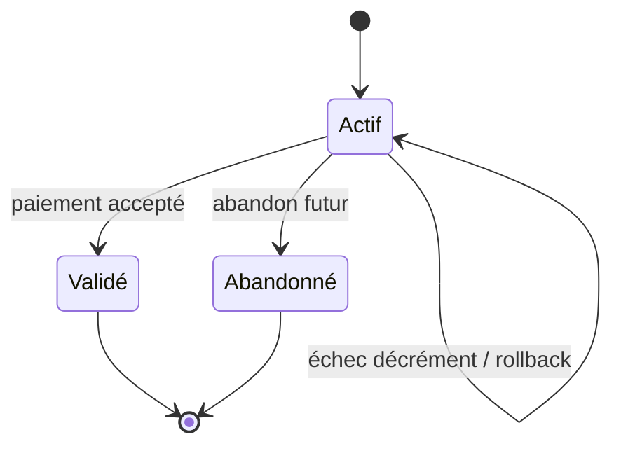
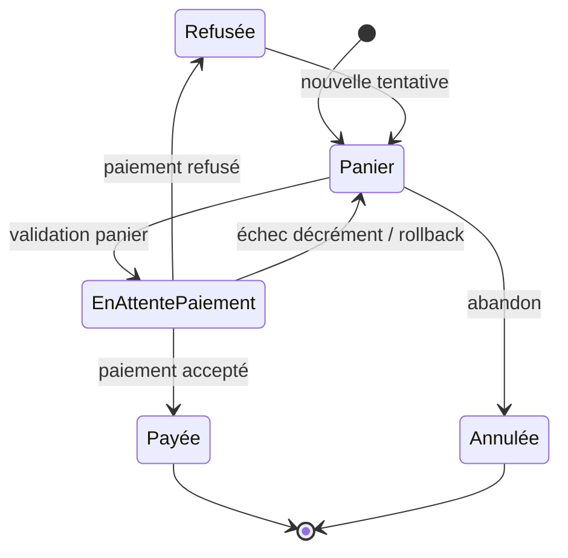

# Diagrammes d'états

Les diagrammes sont des modèles de validation cibles. Ils devront être ajustés si l'implémentation choisit des noms de statuts différents.

## Concert

Exigences liées : EF1, EF2, EF11, EM4, EM5, EM9, RG1, RG7.

Statuts implémentés : `draft`, `open`, `closed`, `sold_out`, `cancelled`, `finished`.

## Panier

Exigences liées : EF5, EF6, EF7, EF8, EF9, EM1, EM2, EM3, RG2, RG3, RG4, RG5.

Statuts implémentés : `active`, `checked_out`, `abandoned`. Un paiement refusé
ou un échec du décrément conditionnel laisse le panier `active`.

## Commande

Exigences liées : EF7, EF8, EF9, EF10, EF12, EM6, EM10, RG4, RG5.

Statuts implémentés : `pending`, `paid`, `refused`, `cancelled`.

Dans le parcours simulé, la carte `4242424242424242` provoque la transition vers `paid`; toute autre carte provoque la transition vers `refused`.

## Cas de test dérivés

Le premier cas dérivé du cycle de vie de commande vérifie la transition vers `refused` : un paiement refusé ne crée pas de commande payée et ne modifie pas le stock.

Exigences : EF9, EM6, RG4.

Le second cas dérivé vérifie la transition vers `paid` : un paiement accepté crée une commande payée, fige les prix et décrémente le stock.

Exigences : EF8, EF12, EM6, EM7, RG5.

Le troisième cas dérivé du cycle de vie de concert vérifie l'annulation admin : un concert passe en `cancelled`, ne peut plus recevoir de réservation et conserve les commandes payées existantes.

Exigences : EF11, EM5, EM9, RG7.

Le quatrième cas dérivé vérifie la clôture admin : un concert passe en `closed`, reste consultable, ne peut plus recevoir de réservation et conserve son stock restant.

Exigences : EF11, EM9, RG1.

Le cinquième cas dérivé vérifie le rollback du paiement accepté si le décrément
conditionnel du stock échoue : aucune commande ni aucun paiement ne persiste, le
stock reste inchangé et le panier reste `active`.

Exigences : EF12, EM1, EM6, ENF4, RG2, RG5.
