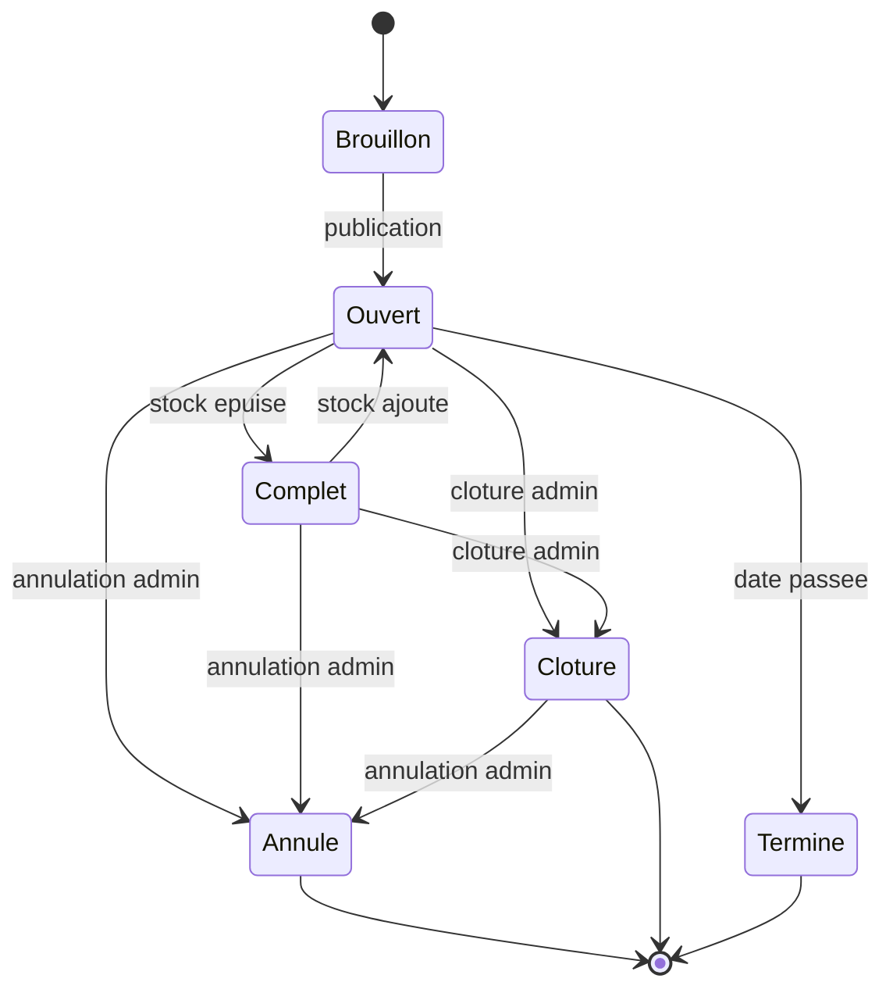
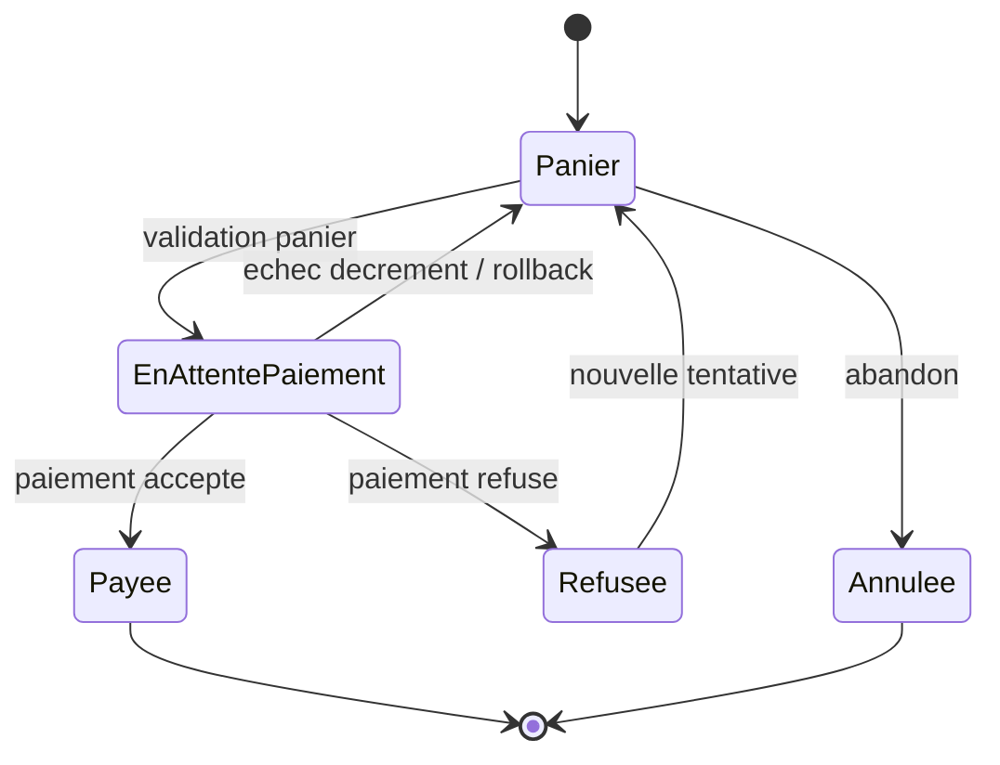

# Diagrammes d'etats

Les diagrammes sont des modeles de validation cibles. Ils devront etre ajustes si l'implementation choisit des noms de statuts differents.

## Concert

Exigences liees : EF1, EF2, EF11, EM4, EM5, EM9, RG1, RG7.

Statuts implementes : `draft`, `open`, `closed`, `sold_out`, `cancelled`, `finished`.

## Panier

Exigences liees : EF5, EF6, EF7, EF8, EF9, EM1, EM2, EM3, RG2, RG3, RG4, RG5.

Statuts implementes : `active`, `checked_out`, `abandoned`. Un paiement refuse
ou un echec du decrement conditionnel laisse le panier `active`.

## Commande

Exigences liees : EF7, EF8, EF9, EF10, EF12, EM6, EM10, RG4, RG5.

Statuts implementes : `pending`, `paid`, `refused`, `cancelled`.

Dans le parcours simule, la carte `4242424242424242` provoque la transition vers `paid`; toute autre carte provoque la transition vers `refused`.

## Cas de test derive

Le premier cas derive du cycle de vie de commande verifie la transition vers `refused` : un paiement refuse ne cree pas de commande payee et ne modifie pas le stock.

Exigences : EF9, EM6, RG4.

Le second cas derive verifie la transition vers `paid` : un paiement accepte cree une commande payee, fige les prix et decremente le stock.

Exigences : EF8, EF12, EM6, EM7, RG5.

Le troisieme cas derive du cycle de vie de concert verifie l'annulation admin : un concert passe en `cancelled`, ne peut plus recevoir de reservation et conserve les commandes payees existantes.

Exigences : EF11, EM5, EM9, RG7.

Le quatrieme cas derive verifie la cloture admin : un concert passe en `closed`, reste consultable, ne peut plus recevoir de reservation et conserve son stock restant.

Exigences : EF11, EM9, RG1.

Le cinquieme cas derive verifie le rollback du paiement accepte si le decrement
conditionnel du stock echoue : aucune commande ni aucun paiement ne persiste, le
stock reste inchange et le panier reste `active`.

Exigences : EF12, EM1, EM6, ENF4, RG2, RG5.
