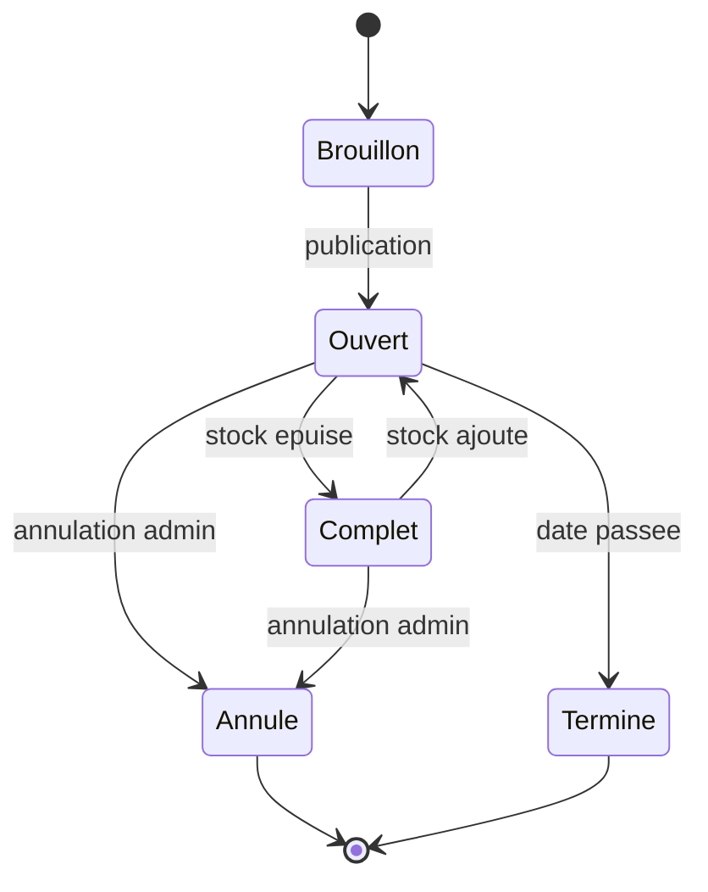
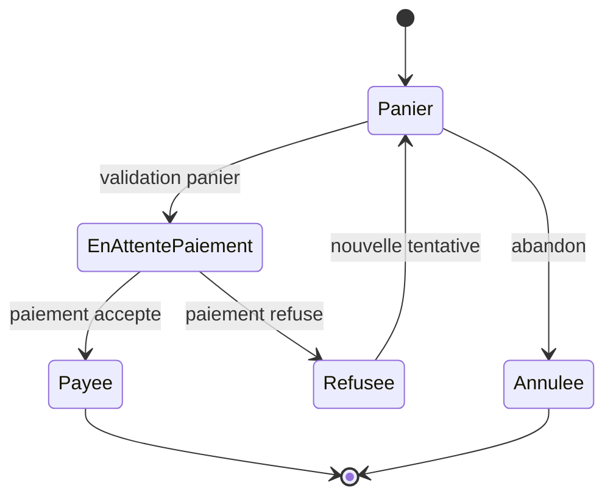

# Diagrammes d'etats

Les diagrammes sont des modeles de validation cibles. Ils devront etre ajustes si l'implementation choisit des noms de statuts differents.

## Concert

Exigences liees : EF1, EF2, EF11, EM4, EM5, EM9, RG1, RG7.

## Commande

Exigences liees : EF7, EF8, EF9, EF10, EF12, EM6, EM10, RG4, RG5.

## Cas de test derive

Le premier cas derive du cycle de vie de commande devra verifier la transition `EnAttentePaiement --> Refusee` : un paiement refuse ne cree pas de commande payee et ne modifie pas le stock.

Exigences : EF9, EM6, RG4.
