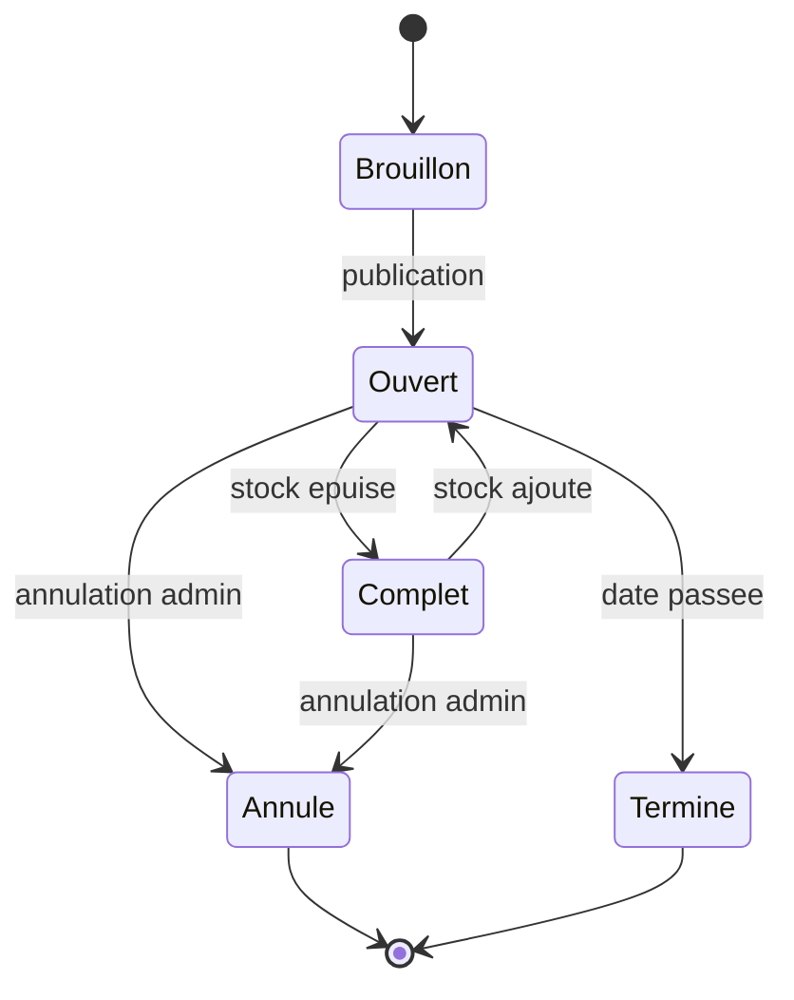
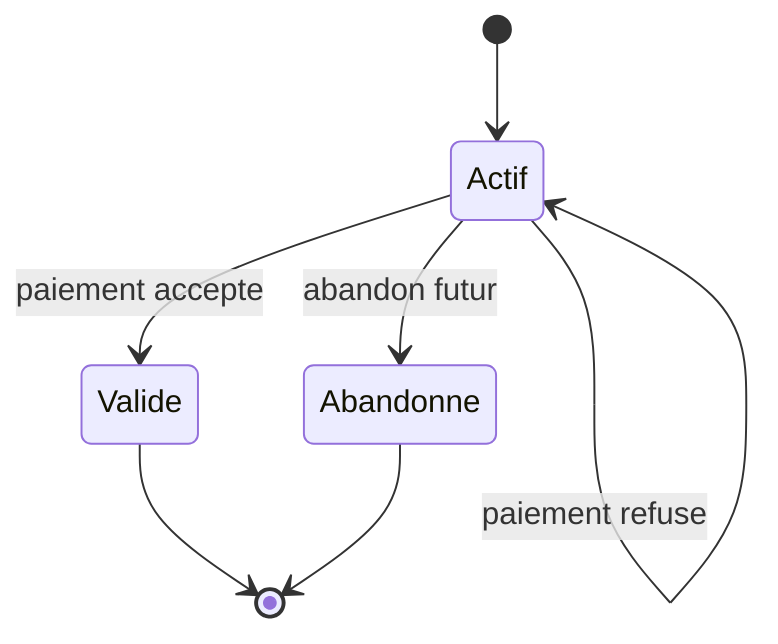
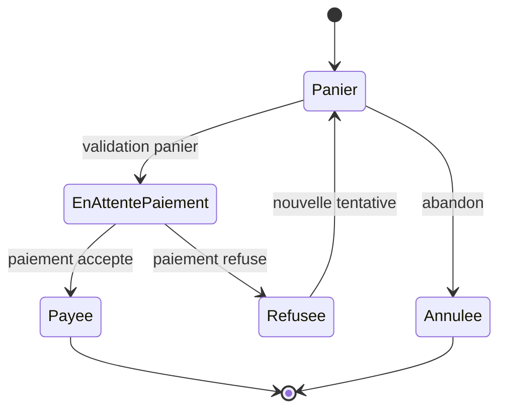

# Diagrammes d'etats

Les diagrammes sont des modeles de validation cibles. Ils devront etre ajustes si l'implementation choisit des noms de statuts differents.

## Concert

Exigences liees : EF1, EF2, EF11, EM4, EM5, EM9, RG1, RG7.

Statuts implementes : `draft`, `open`, `sold_out`, `cancelled`, `finished`.

## Panier

Exigences liees : EF5, EF6, EF7, EF8, EF9, EM1, EM2, EM3, RG2, RG3, RG4, RG5.

## Commande

Exigences liees : EF7, EF8, EF9, EF10, EF12, EM6, EM10, RG4, RG5.

Statuts implementes : `pending`, `paid`, `refused`, `cancelled`.

## Cas de test derive

Le premier cas derive du cycle de vie de commande verifie la transition vers `refused` : un paiement refuse ne cree pas de commande payee et ne modifie pas le stock.

Exigences : EF9, EM6, RG4.
